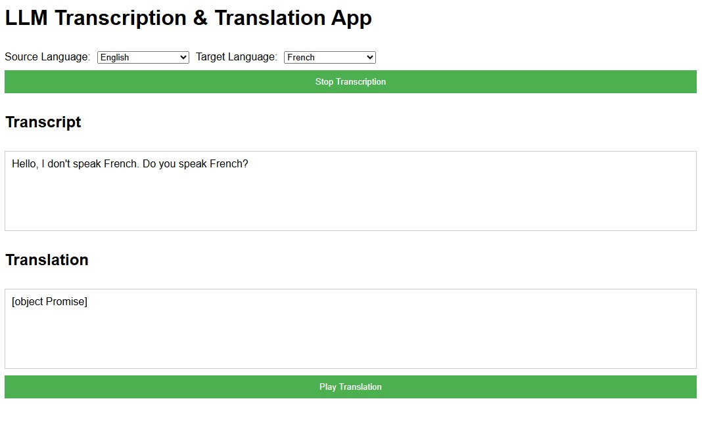

# Healthcare-Translator
An LLM powered prototype web-app that enables real-time, multilingual translation between patients and healthcare providers.
Try the app here: [https://amiorhmn.github.io/Healthcare-Translator](https://amiorhmn.github.io/Healthcare-Translator/).



## Features
- Real-time Transcription and Translation
- Translation audio playback
- Language Selection for both source language and target language from a list of supported languages
- Mobile friendly responsive UI
- Error handling

## Usage
1. Open the web application using the url [https://amiorhmn.github.io/Healthcare-Translator](https://amiorhmn.github.io/Healthcare-Translator/)
2. Select source language and target language from dropdown menus
3. Click the "Start Transcription" button to begin real-time speech transcription
4. Allow microphone use permission if asked by the browser
5. Speak clearly in the selected source language
6. The transcribed text will appear in the "Transcript" section
7. The transcribed text will be automatically translated into the target language
8. Click the "Play Translation" button to hear the translated text
9. Click the "Stop Transcription" button to stop the transcription process

*If you find that the server is down or the translation function is not working due to API not responding, please create an issue.*

## Key Components

### Backend (Flask Application)
Handles translation requests using OpenAI API. The Flask application is currently hosted on *Pythonanywhere*. As the API key is stored on the server, no additional key has to be provided by the user.

### Frontend
The frontend is made up of HTML and vanilla JavaScript. The speech transcription is done by _Web Speech API_ on the client side. So, browser compatibility is required with _Web Speech API_.

## Tools Used
- Flask
- Pythonanywhere hosting service
- OpenAI API
- Web Speech API
- GitHub Pages

## How to Run Locally
1. Clone the repository
   ```
   $ git clone https://github.com/amiorhmn/Healthcare-Translator.git
   $ cd Healthcare-Translator
   ```
2. Create and activate a virtual environment
   ```
   $ python -m venv .venv
   $ source .venv/bin/activate  # On Windows, use `.venv\Scripts\activate`
   ```
3. Install the requirements
   ```
   $ pip install -r /backend/requirements.txt
   ```
4. Create a `.env` file inside the `backend` folder and store your _API key_ inside it
5. Open the `flask_app.py` file and provide _base url_ and _model name_ to `base_url` and `model` variables resepectively
6. Run the flask app
   ```
   $ python .\backend\app.py
   ```
7. Open the `script.js` file: inside the `translateText` function, replace the server url with appropriate local url
8. Start the frontend of the app
   ```
   start index.html
   ```
